# Byte Wave / PhysiMate — Diagrams

## UML Class Diagram

```mermaid
classDiagram
    direction TB

    %% ═══════════════════════════════════════════════════
    %% FASTAPI APPLICATION
    %% ═══════════════════════════════════════════════════
    class FastAPIApp {
        +title: str
        +_jobs: dict~str,dict~
        +_render_cache: dict~str,dict~
        +_waitlist: list~dict~
        +_forum_posts: list~dict~
        +_executor: ThreadPoolExecutor
        +RATE_LIMIT_MAX: int = 10
        +RATE_LIMIT_WINDOW: int = 60
        +MAX_RENDER_RETRIES: int = 1
        +_CACHE_TTL_SECONDS: int = 86400
        +init_learning_db() void
        +prewarm_manim() void
        +rate_limit_middleware(request, call_next) Response
        +no_cache_frontend(request, call_next) Response
        +_render_with_retries(code, plan, question, quality) dict
        +_render_job_safe(job_id, code, plan, question, quality) void
        +_cache_key(question, params) str
        +_get_from_render_cache(question, params) dict
        +_set_render_cache(question, params, result) void
    }

    %% ═══════════════════════════════════════════════════
    %% REQUEST / RESPONSE MODELS  (Pydantic)
    %% ═══════════════════════════════════════════════════
    class BaseModel {
        <<Pydantic>>
    }

    class QuestionRequest {
        +question: str
    }
    class CodeRequest {
        +question: str
        +plan: str
    }
    class RenderRequest {
        +code: str
        +plan: str
        +question: str
        +quality: str = "low"
    }
    class AsyncRenderRequest {
        +code: str
        +plan: str
        +question: str
        +quality: str = "low"
    }
    class QuickRenderRequest {
        +question: str
        +quality: str = "low"
    }
    class FollowupRequest {
        +message: str
        +history: list~dict~
        +previous_code: str
        +previous_plan: str
        +original_question: str
        +quality: str = "low"
    }
    class LearnSessionRequest {
        +student_id: str
        +skill: str
        +case_id: str
    }
    class LearnSubmitRequest {
        +student_id: str
        +session_id: str
        +skill: str
        +case_id: str
        +qa_pairs: list~dict~
    }
    class LearnStudentRequest {
        +student_id: str
        +name: str = "Student"
    }
    class BWAssessRequest {
        +user_id: str = "1"
        +case_id: str
        +user_answer: str
    }
    class BWChatRequest {
        +messages: list~dict~
    }
    class WaitlistJoinRequest {
        +email: str
    }
    class ForumPostRequest {
        +id: str
        +title: str
        +body: str
        +author: str
        +tags: list~str~
        +videoUrl: str
        +upvotes: int
        +replies: list~dict~
        +createdAt: str
    }
    class ForumReplyRequest {
        +id: str
        +author: str
        +body: str
        +upvotes: int
        +createdAt: str
    }
    class UpvoteRequest {
        +userId: str
    }

    BaseModel <|-- QuestionRequest
    BaseModel <|-- CodeRequest
    BaseModel <|-- RenderRequest
    BaseModel <|-- AsyncRenderRequest
    BaseModel <|-- QuickRenderRequest
    BaseModel <|-- FollowupRequest
    BaseModel <|-- LearnSessionRequest
    BaseModel <|-- LearnSubmitRequest
    BaseModel <|-- LearnStudentRequest
    BaseModel <|-- BWAssessRequest
    BaseModel <|-- BWChatRequest
    BaseModel <|-- WaitlistJoinRequest
    BaseModel <|-- ForumPostRequest
    BaseModel <|-- ForumReplyRequest
    BaseModel <|-- UpvoteRequest

    FastAPIApp ..> QuestionRequest : receives
    FastAPIApp ..> RenderRequest : receives
    FastAPIApp ..> FollowupRequest : receives
    FastAPIApp ..> LearnSubmitRequest : receives
    FastAPIApp ..> BWAssessRequest : receives
    FastAPIApp ..> BWChatRequest : receives

    %% ═══════════════════════════════════════════════════
    %% AGENT SERVICE  (agent.py)
    %% ═══════════════════════════════════════════════════
    class AgentService {
        <<module: agent.py>>
        +MODEL_NAME: str = "deepseek-chat"
        +CODE_MODEL: str = "deepseek-reasoner"
        +MAX_QUESTION_LENGTH: int = 4000
        +MAX_PLAN_LENGTH: int = 8000
        +MAX_PLAN_WORDS: int = 350
        +VOICEOVER_ENABLED: bool
        +MANIM_SKELETON: str
        +sanitize_question(text) str
        +generate_animation_plan(question) str
        +generate_manim_code(plan, question) str
        +generate_plan_and_code(question) tuple~str,str~
        +fix_manim_code(plan, code, error) str
        +generate_template_manim_code(question, params) str
        +followup_chat(message, history, plan, code, question) dict
        +generate_matter_scene(question, params) dict
        +match_template(question) str
        +_extract_numeric_params(text) dict
        +_extract_physics_conditions(text) dict
        +_call_llm(messages, model, max_retries) str
        +_adapt_messages_for_reasoner(messages) list
        +_get_manim_skeleton() str
    }

    %% ═══════════════════════════════════════════════════
    %% RENDER PIPELINE  (manim_runner.py)
    %% ═══════════════════════════════════════════════════
    class ManimExecutionError {
        <<Exception>>
        +stderr: str
        +__init__(message, stderr) void
    }

    class RenderService {
        <<module: manim_runner.py>>
        +MANIM_RENDER_TIMEOUT: int = 240
        +CLEANUP_MAX_AGE_HOURS: int = 24
        +MEDIA_OUTPUT_DIR: Path
        +run_manim_script(code, quality) str
        +cleanup_old_media(max_age_hours) void
        +_check_syntax(code) void
    }

    Exception <|-- ManimExecutionError
    RenderService ..> ManimExecutionError : raises

    %% ═══════════════════════════════════════════════════
    %% LEARNING ENGINE  (learn.py)
    %% ═══════════════════════════════════════════════════
    class LearningEngine {
        <<module: learn.py>>
        +SKILLS: dict
        +_CASE_LOOKUP: dict
        +_REMEDIATION_PROMPTS: dict
        +_DB_PATH: Path
        +init_db() void
        +get_or_create_student(student_id, name) dict
        +get_mastery(student_id) dict
        +start_session(student_id, skill, case_id) str
        +complete_session(session_id, student_id, skill, score, delta, gaps, answers) void
        +generate_questions(skill, case_id, mastery_score) list~dict~
        +evaluate_answers(skill, case_id, qa_pairs) dict
        +get_recommendations(student_id) dict
        +get_remediation_prompt(case_id, concept) str
        +save_animation(question, video_url, quality) str
        +get_animations(limit) list~dict~
        +delete_animation(anim_id) bool
        +get_saved_video_urls() set~str~
    }

    %% ═══════════════════════════════════════════════════
    %% RAG KNOWLEDGE BASE  (rag/knowledge_base.py)
    %% ═══════════════════════════════════════════════════
    class KnowledgeBase {
        <<module: rag/knowledge_base.py>>
        +CHROMA_PATH: Path
        +add_example(topic, description, manim_code, visual_rules, metadata) str
        +query_examples(question, n_results) list~dict~
        +list_examples() list~dict~
        +examples_count() int
    }

    %% ═══════════════════════════════════════════════════
    %% DATABASE ENTITIES  (SQLite — learn.db)
    %% ═══════════════════════════════════════════════════
    class Student {
        <<entity>>
        +id: TEXT PK
        +name: TEXT
        +created_at: REAL
    }
    class Mastery {
        <<entity>>
        +student_id: TEXT FK
        +skill: TEXT
        +score: INTEGER
        +attempts: INTEGER
        +last_updated: REAL
        +gaps: TEXT JSON
    }
    class Session {
        <<entity>>
        +id: TEXT PK
        +student_id: TEXT FK
        +skill: TEXT
        +case_id: TEXT
        +started_at: REAL
        +completed_at: REAL
        +score: INTEGER
    }
    class Answer {
        <<entity>>
        +id: TEXT PK
        +session_id: TEXT FK
        +question_text: TEXT
        +student_answer: TEXT
        +correct: INTEGER
        +gap_label: TEXT
        +feedback: TEXT
    }
    class AnimationRecord {
        <<entity>>
        +id: TEXT PK
        +question: TEXT
        +video_url: TEXT
        +quality: TEXT
        +created_at: REAL
    }

    Student "1" *-- "many" Mastery : has
    Student "1" *-- "many" Session : takes
    Session "1" *-- "many" Answer : contains

    LearningEngine ..> Student : manages
    LearningEngine ..> Mastery : updates
    LearningEngine ..> Session : creates
    LearningEngine ..> Answer : records
    LearningEngine ..> AnimationRecord : persists

    %% ═══════════════════════════════════════════════════
    %% DATA STRUCTURES
    %% ═══════════════════════════════════════════════════
    class Skill {
        <<dataclass>>
        +id: str
        +label: str
        +icon: str
        +description: str
        +cases: list~Case~
    }
    class Case {
        <<dataclass>>
        +id: str
        +label: str
        +desc: str
        +question: str
        +hint: str
    }
    class RenderJob {
        <<dataclass>>
        +status: str
        +progress: str
        +result: dict
        +error: str
        +started_at: float
    }
    class RenderResult {
        <<dataclass>>
        +video_url: str
        +final_code: str
        +retries: int
        +fallback_used: bool
    }
    class MatterScene {
        <<dataclass>>
        +supported: bool
        +domain: str
        +physics: dict
        +bodies: list
        +params: list
    }

    Skill "1" *-- "many" Case : contains
    LearningEngine ..> Skill : uses
    FastAPIApp ..> RenderJob : tracks
    FastAPIApp ..> RenderResult : returns
    AgentService ..> MatterScene : generates

    %% ═══════════════════════════════════════════════════
    %% EXTERNAL DEPENDENCIES
    %% ═══════════════════════════════════════════════════
    class DeepSeekClient {
        <<external: OpenAI SDK>>
        +base_url: str = "https://api.deepseek.com"
        +model: deepseek-chat
        +code_model: deepseek-reasoner
        +chat.completions.create(messages, model) Response
    }
    class ChromaDB {
        <<external>>
        +PersistentClient(path) Client
        +get_or_create_collection(name, metadata) Collection
        +Collection.upsert(ids, documents, metadatas) void
        +Collection.query(query_texts, n_results) Results
        +Collection.count() int
    }
    class ManimLib {
        <<external subprocess>>
        +PhysicsAnimation(Scene)
        +VoiceoverScene
        +quality: low|medium|high
        +output: MP4 file
    }
    class CoquiTTS {
        <<external: optional>>
        +model: xtts_v2
        +speaker_wav: 3b1b_voice.wav
        +synthesize(text) audio
    }
    class MiniMaxAPI {
        <<external>>
        +base_url: https://api.minimax.io/v1
        +model: M2-her
        +chatcompletion_v2(messages) Response
    }

    AgentService --> DeepSeekClient : calls
    LearningEngine --> DeepSeekClient : calls
    KnowledgeBase --> ChromaDB : stores/queries
    RenderService --> ManimLib : subprocess
    ManimLib ..> CoquiTTS : optional TTS

    %% ═══════════════════════════════════════════════════
    %% FRONTEND CLASSES
    %% ═══════════════════════════════════════════════════
    class PhysicsSimulator {
        <<class: physimate-simulator.js>>
        +containerId: string
        +scene: object
        +params: object
        +engine: Matter.Engine
        +render: Matter.Render
        +runner: Matter.Runner
        +bodies: object
        +running: boolean
        +init() void
        +start() void
        +stop() void
        +updateParam(id, value) void
        +destroy() void
    }
    class PhysiMateChat {
        <<module: physimate-script.js>>
        +API_BASE: string
        +conversationHistory: array
        +currentPlan: string
        +currentCode: string
        +animationHistory: array
        +sendQuestion(question) void
        +pollJobStatus(jobId) void
        +handleFollowup(message) void
        +loadAnimationsFromDB() void
        +isRefinement(text) bool
    }
    class ByteWaveApp {
        <<module: frontend/src>>
        +useSpacedRepetition() hook
        +useForum() hook
        +useAnalytics() hook
        +fetchSkillMap(userId) void
        +fetchRecommendations(userId) void
        +submitAssessment(caseId, answer) void
        +pollRemediationJob(jobId) void
    }
    class MiniMaxClient {
        <<module: src/api/minimax.js>>
        +MINIMAX_BASE: string
        +sendChatMessage(apiKey, messages, model, maxTokens) string
    }

    ByteWaveApp --> MiniMaxClient : optional chat
    PhysicsSimulator ..> MatterScene : renders

    %% ═══════════════════════════════════════════════════
    %% SERVICE WIRING
    %% ═══════════════════════════════════════════════════
    FastAPIApp --> AgentService : delegates LLM logic
    FastAPIApp --> RenderService : runs Manim
    FastAPIApp --> LearningEngine : adaptive learning
    FastAPIApp --> KnowledgeBase : RAG stats
    AgentService --> KnowledgeBase : retrieves examples
    RenderService ..> LearningEngine : reads protected URLs
    PhysiMateChat --> FastAPIApp : HTTP /api/*
    ByteWaveApp --> FastAPIApp : HTTP /api/*
```

---

## Architecture Diagram

```mermaid
graph TB
    %% ── USER ──────────────────────────────────────────────────────────────
    User(["👤 User / Student"])

    %% ── FRONTEND ──────────────────────────────────────────────────────────
    subgraph Frontend["Frontend  (Vite · localhost:5173)"]
        direction TB

        subgraph BW["Byte Wave App  (index.html)"]
            BW_Home["🏠 Home / Landing"]
            BW_Skills["📚 Skill Map\n(constellation view)"]
            BW_Chat["💬 AI Chat\n(bw_chat endpoint)"]
            BW_Assess["📝 Assess / Q&A\n(bw_assess endpoint)"]
            BW_Forum["🗣️ Forum\n(useForum hook)"]
            BW_Rec["🎯 Recommendations\n(Netflix-style rows)"]
        end

        subgraph PM["PhysiMate Chat  (physimate-chat.html)"]
            PM_Chat["💬 Chat UI\n(physimate-script.js)"]
            PM_Sim["⚙️ Interactive Simulator\n(physimate-simulator.js\nMatter.js engine)"]
            PM_History["📂 Animation History\n(localStorage + DB)"]
        end

        subgraph Hooks["React Hooks / Utilities"]
            H_SR["useSpacedRepetition"]
            H_Forum["useForum"]
            H_Analytics["useAnalytics"]
            H_Hold["useHoldActivation"]
            H_Scroll["useScrollAnimation"]
        end

        MiniMax_API["MiniMax API Client\n(src/api/minimax.js)\nM2-her model"]
    end

    %% ── BACKEND ───────────────────────────────────────────────────────────
    subgraph Backend["Backend  (FastAPI · localhost:8000)"]
        direction TB

        MW["Middleware\n• CORS\n• Rate Limiter (10 req/min)\n• Cache-Control headers"]

        subgraph Routes["API Routes  (main.py)"]
            R_Quick["/api/quick_render\nTemplate fast-path"]
            R_PlanCode["/api/generate_plan_and_code\nCombined LLM call"]
            R_Plan["/api/generate_plan"]
            R_Code["/api/generate_code"]
            R_RenderAsync["/api/render_async\nNon-blocking"]
            R_RenderSync["/api/render_video\nBlocking"]
            R_Job["/api/job/{id}\nStatus polling"]
            R_Followup["/api/followup\nConversational"]
            R_Simulate["/api/simulate\nMatter.js scene config"]
            R_Chat["/api/chat\nBytewave AI chat"]
            R_Assess["/api/assess\nAnswer evaluation"]
            R_Progress["/api/progress/{uid}"]
            R_Recs["/api/recommendations/{uid}"]
            R_Cases["/api/cases/{skill}"]
            R_Learn["/api/learn/*\nFull learning flow"]
            R_Anim["/api/animations\nSaved library"]
            R_Forum["/api/forum/*\nForum CRUD"]
            R_Waitlist["/api/waitlist"]
            R_RAG["/api/rag/stats"]
            R_Clips["/api/admin/prerender-clips"]
            R_Health["/health"]
        end

        subgraph AgentLayer["Agent Layer  (agent.py)"]
            A_Sanitize["sanitize_question()"]
            A_PlanCode["generate_plan_and_code()"]
            A_Plan["generate_animation_plan()"]
            A_Code["generate_manim_code()"]
            A_Fix["fix_manim_code()\nself-correction"]
            A_Template["generate_template_manim_code()\ndeterministic fallback"]
            A_Followup["followup_chat()"]
            A_Scene["generate_matter_scene()\nMatter.js JSON"]
            A_Match["match_template()"]
            A_Params["_extract_numeric_params()"]
        end

        subgraph RenderPipeline["Render Pipeline  (manim_runner.py)"]
            RP_Queue["ThreadPoolExecutor\n(4 workers)"]
            RP_Cache["In-Memory Render Cache\n(SHA-256, 24h TTL)"]
            RP_Jobs["Job Store  _jobs{}"]
            RP_Retry["_render_with_retries()\n1 attempt + LLM fix"]
            RP_Manim["run_manim_script()\nsubprocess"]
            RP_Cleanup["cleanup_old_media()\n24h TTL, DB-aware"]
        end

        subgraph LearnEngine["Learning Engine  (learn.py)"]
            L_Skills["SKILLS catalogue\n(kinematics, Newton, etc.)"]
            L_Session["start_session()\ncomplete_session()"]
            L_Questions["generate_questions()\nLLM-generated Q&A"]
            L_Eval["evaluate_answers()\nLLM gap analysis"]
            L_Mastery["get_mastery()\nupdate_mastery()"]
            L_Rec["get_recommendations()\nnext / review / master"]
            L_Remediation["get_remediation_prompt()"]
            L_SaveAnim["save_animation()\nget_animations()"]
        end

        subgraph RAG["RAG System  (rag/)"]
            RAG_KB["knowledge_base.py\nChromaDB cosine similarity"]
            RAG_Seed["seed.py / seed_data.py\nPhysics examples corpus"]
        end

        subgraph StaticFiles["Static File Mounts"]
            SF_Media["/media → media_output/media/"]
            SF_Clips["/videos/clips → media_output/clips/"]
            SF_Frontend["/frontend → frontend/"]
        end
    end

    %% ── EXTERNAL SERVICES ──────────────────────────────────────────────────
    subgraph External["External Services"]
        DS_Chat["DeepSeek API\ndeepseek-chat\n(plans, eval, chat, Q-gen)"]
        DS_R1["DeepSeek API\ndeepseek-reasoner R1\n(Manim code generation)"]
        MX["MiniMax API\nM2-her\n(Bytewave chat alt)"]
        Manim["Manim Library\n+ manim_physics\n+ manim_voiceover\n+ scipy / pymunk"]
        Coqui["Coqui XTTS v2\n3Blue1Brown voice clone\n(optional TTS)"]
    end

    %% ── PERSISTENCE ────────────────────────────────────────────────────────
    subgraph Storage["Persistence"]
        SQLite["SQLite  (learn.db)\n• students\n• mastery\n• sessions\n• session_answers\n• saved_animations"]
        ChromaDB["ChromaDB  (rag/chroma_data/)\nphysics_examples collection"]
        MediaFS["File System\nmedia_output/\n• *.py scripts\n• media/videos/**/*.mp4\n• clips/*.mp4"]
    end

    %% ── CONNECTIONS ────────────────────────────────────────────────────────

    %% User ↔ Frontend
    User -->|"ask physics\nquestion"| PM_Chat
    User -->|"practice cases\n& quiz"| BW_Assess
    User -->|"browse skills"| BW_Skills
    User -->|"forum posts"| BW_Forum

    %% Frontend internal
    PM_Chat -->|"fetch /api/*"| MW
    PM_Sim -->|"GET /api/simulate"| MW
    BW_Chat -->|"POST /api/chat"| MW
    BW_Assess -->|"POST /api/assess"| MW
    BW_Skills -->|"GET /api/progress"| MW
    BW_Rec -->|"GET /api/recommendations"| MW
    BW_Forum -->|"GET/POST /api/forum/*"| MW
    BW_Chat -.->|"optional direct\nchat"| MiniMax_API

    %% MW → Routes
    MW --> Routes

    %% Routes → Agent
    R_PlanCode --> A_PlanCode
    R_Plan --> A_Plan
    R_Code --> A_Code
    R_Quick --> A_Match
    R_Followup --> A_Followup
    R_Simulate --> A_Scene
    R_Chat --> AgentLayer
    R_Assess --> LearnEngine

    %% Routes → Render Pipeline
    R_RenderAsync --> RP_Queue
    R_RenderSync --> RP_Retry
    R_Quick --> RP_Cache
    R_Quick --> RP_Queue
    R_Job --> RP_Jobs

    %% Agent → LLM
    A_Plan -->|"deepseek-chat"| DS_Chat
    A_PlanCode -->|"deepseek-chat"| DS_Chat
    A_Code -->|"deepseek-reasoner"| DS_R1
    A_Fix -->|"deepseek-reasoner"| DS_R1
    A_Followup -->|"deepseek-chat"| DS_Chat
    A_Scene -->|"deepseek-chat"| DS_Chat
    R_Chat -->|"deepseek-chat"| DS_Chat

    %% Agent → RAG
    A_Code -->|"retrieve examples"| RAG_KB
    A_Plan -->|"retrieve examples"| RAG_KB

    %% Render pipeline internals
    RP_Queue --> RP_Jobs
    RP_Queue --> RP_Retry
    RP_Retry -->|"success"| RP_Cache
    RP_Retry -->|"failure → LLM fix"| A_Fix
    RP_Retry -->|"all retries fail"| A_Template
    RP_Retry --> RP_Manim

    %% Manim
    RP_Manim -->|"subprocess"| Manim
    Manim -->|"optional TTS"| Coqui
    Manim -->|"write .mp4"| MediaFS
    RP_Cleanup -->|"delete old files"| MediaFS

    %% Learn engine → LLM
    L_Questions -->|"deepseek-chat"| DS_Chat
    L_Eval -->|"deepseek-chat"| DS_Chat

    %% Learn engine → DB
    L_Session --> SQLite
    L_Mastery --> SQLite
    L_SaveAnim --> SQLite
    L_Rec --> SQLite

    %% RAG → ChromaDB
    RAG_KB --> ChromaDB
    RAG_Seed -->|"seed on init"| ChromaDB

    %% Routes → Learn
    R_Learn --> LearnEngine
    R_Progress --> LearnEngine
    R_Recs --> LearnEngine
    R_Cases --> L_Skills
    R_Anim --> L_SaveAnim

    %% Static
    R_Clips --> SF_Clips
    SF_Media --> MediaFS
    SF_Clips --> MediaFS

    %% Remediation loop
    L_Remediation -->|"kick off render job"| RP_Queue

    %% Styles
    classDef frontend fill:#1a1a3e,stroke:#6366f1,color:#e0e7ff
    classDef backend fill:#0f2027,stroke:#06b6d4,color:#cffafe
    classDef external fill:#1a0a0a,stroke:#f59e0b,color:#fef3c7
    classDef storage fill:#0a1a0a,stroke:#22c55e,color:#dcfce7
    classDef route fill:#0f1629,stroke:#818cf8,color:#c7d2fe
    classDef agent fill:#111827,stroke:#a78bfa,color:#ede9fe
    classDef render fill:#111827,stroke:#38bdf8,color:#e0f2fe
    classDef learn fill:#111827,stroke:#34d399,color:#d1fae5

    class BW_Home,BW_Skills,BW_Chat,BW_Assess,BW_Forum,BW_Rec frontend
    class PM_Chat,PM_Sim,PM_History,MiniMax_API,H_SR,H_Forum,H_Analytics,H_Hold,H_Scroll frontend
    class DS_Chat,DS_R1,MX,Manim,Coqui external
    class SQLite,ChromaDB,MediaFS storage
    class R_Quick,R_PlanCode,R_Plan,R_Code,R_RenderAsync,R_RenderSync,R_Job,R_Followup route
    class R_Simulate,R_Chat,R_Assess,R_Progress,R_Recs,R_Cases,R_Learn,R_Anim,R_Forum,R_Waitlist,R_RAG,R_Clips,R_Health route
    class A_Sanitize,A_PlanCode,A_Plan,A_Code,A_Fix,A_Template,A_Followup,A_Scene,A_Match,A_Params agent
    class RP_Queue,RP_Cache,RP_Jobs,RP_Retry,RP_Manim,RP_Cleanup render
    class L_Skills,L_Session,L_Questions,L_Eval,L_Mastery,L_Rec,L_Remediation,L_SaveAnim learn
    class RAG_KB,RAG_Seed learn
```

---

## Component Summary

| Layer | Technology | Purpose |
|-------|-----------|---------|
| **Frontend — Byte Wave** | Vite + Vanilla JS | Skill map, adaptive learning, forum, recommendations |
| **Frontend — PhysiMate** | HTML/JS + Matter.js | AI physics animation chat + interactive simulator |
| **API Gateway** | FastAPI (uvicorn :8000) | Rate limiting, CORS, routing, job management |
| **Agent Layer** | `agent.py` | LLM orchestration, Manim code generation, self-correction |
| **Render Pipeline** | `manim_runner.py` | Async job queue, retry logic, cache, subprocess Manim |
| **Learning Engine** | `learn.py` | Skill map, mastery tracking, Q&A generation, recommendations |
| **RAG System** | `rag/` + ChromaDB | Physics examples corpus for few-shot code generation |
| **LLM — Planning** | DeepSeek `deepseek-chat` | Plans, evaluations, chat, Q-generation, Matter.js scenes |
| **LLM — Coding** | DeepSeek `deepseek-reasoner` (R1) | Manim code generation & self-correction |
| **Animation** | Manim + manim_physics | Rendered MP4 physics animations |
| **TTS** | Coqui XTTS v2 (optional) | 3Blue1Brown-style voice narration |
| **Database** | SQLite `learn.db` | Students, mastery, sessions, saved animations |
| **Vector DB** | ChromaDB | Cosine-similarity retrieval of physics code examples |
| **Media Storage** | Local filesystem | Generated `.py` scripts and `.mp4` videos |
